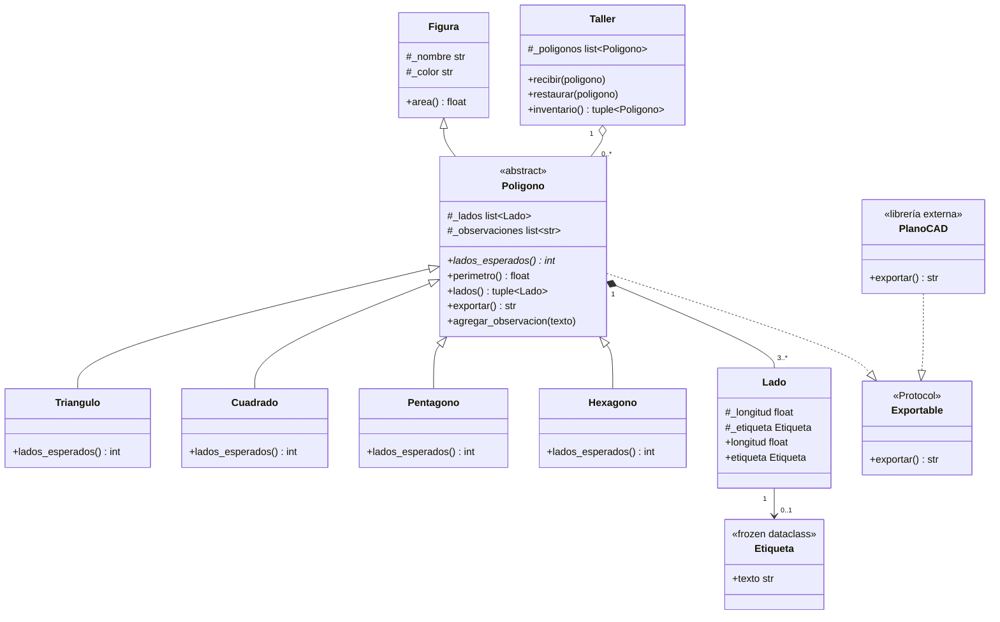

# Modelo final — `figuras.py`

**Cómo leer las relaciones:**

- `Figura <|-- Poligono`: herencia normal. `Poligono` es abstracta (`lados_esperados()` es `@abstractmethod`), así que no se puede instanciar directo.
- `Poligono *-- Lado`: composición. `Poligono.__init__` arma su propia lista de `Lado` (`figuras.py:62`), no la recibe ya armada de afuera para después compartirla.
- `Lado --> Etiqueta` (0..1): asociación. En `figuras.py:25` la `Etiqueta` es un parámetro opcional (default `None`) — ninguno de los dos objetos controla el ciclo de vida del otro.
- `Taller o-- Poligono` (0..\*): agregación. `Taller.recibir` (`figuras.py:142`) recibe polígonos que ya existían antes; si los saco del taller, siguen siendo válidos.
- `Poligono ..|> Exportable`, `PlanoCAD ..|> Exportable`: acá no hay herencia, es cumplimiento por forma (`Protocol`) — por eso `PlanoCAD` cumple el contrato sin heredar de nada mío.
